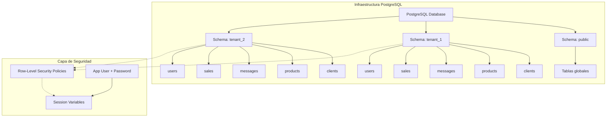
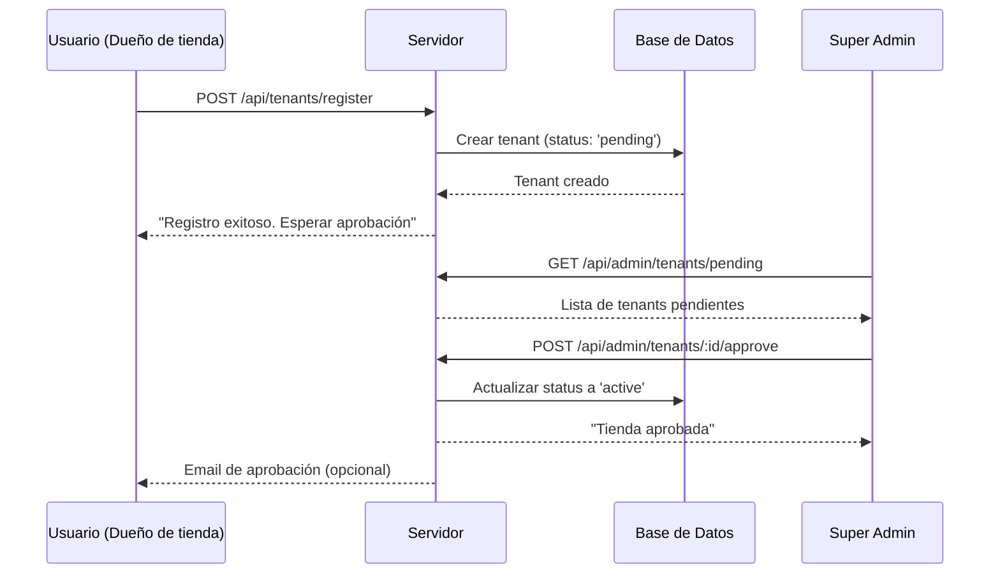
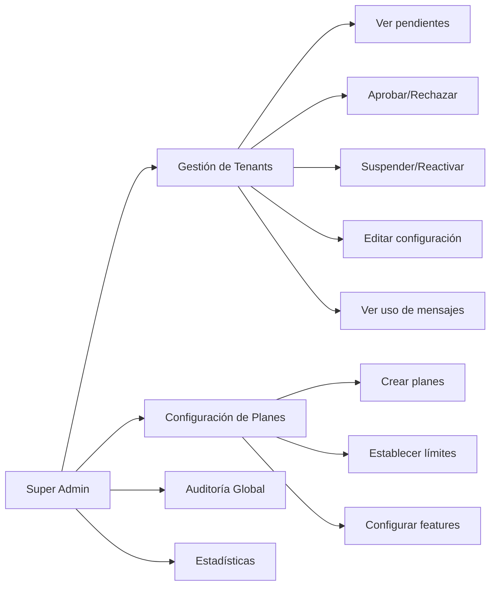
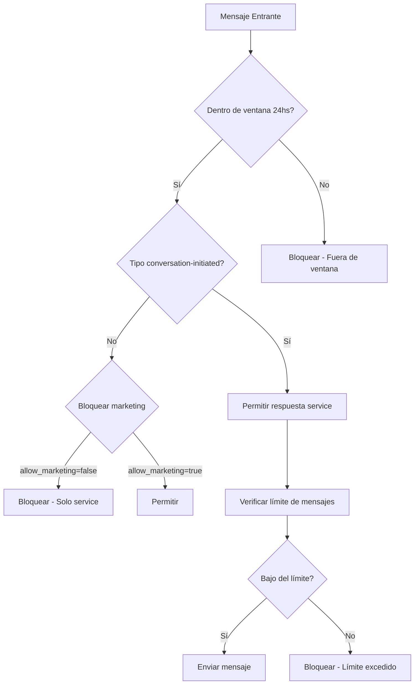
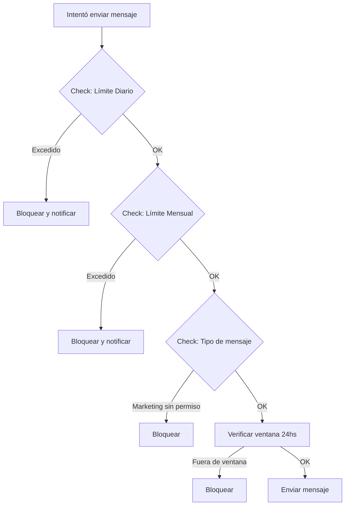

# Plan de Transformación: CRM SaaS Multi-tenant

## Visión General

Transformar el CRM actual (mono-tenant) en una plataforma SaaS multi-tenant con:
- Registro de tiendas con aprobación del super admin
- Panel de super obligatoria admin para control total de tiendas
- APIs propias configurables por cada tenant (WhatsApp/Instagram)
- Restricciones de mensajes: solo respuestas tipo "service" (gratuitos) dentro de 24hs
- Controles para evitar gastos no deseados

---

## 1. Arquitectura Multi-tenant

### Estrategia de Aislamiento: Schema por Tenant + RLS

PostgreSQL permite combinar **schema por tenant** con **Row-Level Security (RLS)** para máximo aislamiento y seguridad.



### Row-Level Security (RLS)

PostgreSQL RLS permite definir políticas de seguridad a nivel de fila que se aplican automáticamente a todas las consultas:

```sql
-- Habilitar RLS en una tabla
ALTER TABLE tenant_1.clients ENABLE ROW LEVEL SECURITY;

-- Crear política que filtra por el tenant actual
CREATE POLICY tenant_isolation_policy 
ON tenant_1.clients 
USING (current_setting('app.tenant_id') = tenant_id::text);

-- Función para establecer el tenant en la sesión
CREATE OR REPLACE FUNCTION set_tenant(p_tenant_id INTEGER)
RETURNS void AS $
BEGIN
  PERFORM set_config('app.tenant_id', p_tenant_id::text, true);
END;
$ LANGUAGE plpgsql SECURITY DEFINER;
```

### Ventajas de esta Combinación

| Capa | Beneficio |
|------|-----------|
| **Schema por tenant** | Aislamiento total de datos a nivel de objeto |
| **RLS** | Seguridad automática aunque el código falle |
| **双重 protección** | Si alguien accede a la DB directamente, RLS protege |

### Modelo de Datos - Schema Global

```sql
-- Tabla de tenants (tiendas/locales)
CREATE TABLE tenants (
    id SERIAL PRIMARY KEY,
    slug TEXT UNIQUE NOT NULL,           -- Identificador único (ej: tienda-maria)
    name TEXT NOT NULL,                   -- Nombre de la tienda
    owner_name TEXT NOT NULL,             -- Nombre del responsable
    owner_email TEXT UNIQUE NOT NULL,      -- Email del dueño
    owner_phone TEXT,                      -- Teléfono de contacto
    domain TEXT,                          -- Dominio personalizado (opcional)
    logo_url TEXT,                        -- Logo de la tienda
    status TEXT DEFAULT 'pending',        -- pending, active, suspended, rejected
    plan TEXT DEFAULT 'free',             -- free, basic, pro
    message_limit_monthly INTEGER DEFAULT 0,
    messages_sent_monthly INTEGER DEFAULT 0,
    last_message_reset TIMESTAMP,
    created_at TIMESTAMP DEFAULT CURRENT_TIMESTAMP,
    approved_at TIMESTAMP,
    approved_by INTEGER REFERENCES super_admins(id),
    updated_at TIMESTAMP DEFAULT CURRENT_TIMESTAMP
);

-- Tabla de super administradores
CREATE TABLE super_admins (
    id SERIAL PRIMARY KEY,
    username TEXT UNIQUE NOT NULL,
    password TEXT NOT NULL,
    role TEXT DEFAULT 'super_admin',
    created_at TIMESTAMP DEFAULT CURRENT_TIMESTAMP,
    last_login TIMESTAMP
);

-- Configuraciones de APIs por tenant
CREATE TABLE tenant_configs (
    id SERIAL PRIMARY KEY,
    tenant_id INTEGER REFERENCES tenants(id) ON DELETE CASCADE,
    
    -- WhatsApp Business API (propio del cliente)
    whatsapp_token TEXT,                  -- Token del cliente (encriptado)
    whatsapp_phone_id TEXT,               -- Phone ID del cliente
    whatsapp_business_account_id TEXT,
    whatsapp_webhook_verify_token TEXT,
    whatsapp_enabled BOOLEAN DEFAULT FALSE,
    
    -- Instagram Business API (propio del cliente)
    instagram_access_token TEXT,          -- Token del cliente (encriptado)
    instagram_business_account_id TEXT,
    instagram_webhook_verify_token TEXT,
    instagram_enabled BOOLEAN DEFAULT FALSE,
    
    -- Meta Graph API Version
    meta_graph_version TEXT DEFAULT 'v21.0',
    
    -- Configuración de costos
    max_messages_per_day INTEGER DEFAULT 100,
    max_messages_per_month INTEGER DEFAULT 1000,
    allow_marketing_messages BOOLEAN DEFAULT FALSE,  -- Solo service messages
    cost_alert_threshold INTEGER DEFAULT 80,  -- Porcentaje de uso
    
    -- Configuración de 24hs
    response_window_hours INTEGER DEFAULT 24,
    allow_initiate_conversation BOOLEAN DEFAULT FALSE,
    
    created_at TIMESTAMP DEFAULT CURRENT_TIMESTAMP,
    updated_at TIMESTAMP DEFAULT CURRENT_TIMESTAMP
);

-- Tabla de logs de auditoría por tenant
CREATE TABLE tenant_audit_logs (
    id SERIAL PRIMARY KEY,
    tenant_id INTEGER REFERENCES tenants(id),
    action TEXT NOT NULL,
    details JSONB,
    ip_address TEXT,
    user_agent TEXT,
    created_at TIMESTAMP DEFAULT CURRENT_TIMESTAMP
);
```

---

## 2. Sistema de Registro y Aprobación

### Flujo de Registro



### Endpoints de Registro

```
POST   /api/tenants/register
   - Input: { name, owner_name, owner_email, owner_phone, password }
   - Output: { message: "Registro exitoso. Esperar aprobación del administrador" }
   - Estado inicial: 'pending' (sin acceso)

POST   /api/tenants/login
   - Input: { email, password }
   - Output: { token, tenant: {...} }
   - Solo permite login si status === 'active'
```

---

## 3. Panel de Super Admin

### Funcionalidades



### Endpoints del Super Admin

```
GET    /api/admin/tenants              - Listar todos los tenants
GET    /api/admin/tenants/pending     - Listar tenants pendientes de aprobación
GET    /api/admin/tenants/:id         - Ver detalle de un tenant
PUT    /api/admin/tenants/:id         - Editar tenant
POST   /api/admin/tenants/:id/approve - Aprobar tenant (dar acceso)
POST   /api/admin/tenants/:id/reject   - Rechazar tenant
POST   /api/admin/tenants/:id/suspend - Suspender acceso
POST   /api/admin/tenants/:id/reactivate - Reactivar acceso
DELETE /api/admin/tenants/:id         - Eliminar tenant

GET    /api/admin/tenants/:id/stats   - Estadísticas de uso de mensajes
GET    /api/admin/tenants/:id/config   - Ver configuración de APIs
PUT    /api/admin/tenants/:id/config  - Actualizar configuración de APIs
PUT    /api/admin/tenants/:id/limits  - Actualizar límites de mensajes

GET    /api/admin/audit-logs          - Logs de auditoría global
GET    /api/admin/analytics           - Estadísticas globales
```

### Dashboard del Super Admin

- **Resumen**: Total de tenants, activos, pendientes, suspendidos
- **Tenants Pendientes**: Lista con botones de aprobar/rechazar
- **Tenants Activos**: Ver uso de mensajes, configuración, suspender
- **Estadísticas**: Mensajes enviados por tenant, tendencia de uso

---

## 4. APIs Propias del Cliente (WhatsApp/Instagram)

### Configuración por Tenant

Cada tenant puede configurar sus propias credenciales de Meta:

```javascript
// Estructura de tenant_config
{
  tenant_id: 1,
  
  // WhatsApp (propio del cliente)
  whatsapp_token: "encryted_token...",      // Almacenado encriptado
  whatsapp_phone_id: "123456789012345",
  whatsapp_business_account_id: "987654321",
  whatsapp_enabled: true,
  
  // Instagram (propio del cliente)
  instagram_access_token: "encrypted_token...",
  instagram_business_account_id: "111222333",
  instagram_enabled: false,
  
  // Controles de costo
  max_messages_per_day: 100,
  max_messages_per_month: 1000,
  allow_marketing_messages: false  // IMPORTANTE: Solo service
}
```

### Middleware de Configuración por Tenant

```javascript
// tenantConfigMiddleware.js
async function getTenantConfig(tenantId) {
  const configs = await runQuery(
    'SELECT * FROM tenant_configs WHERE tenant_id = $1',
    [tenantId]
  );
  return configs[0] || null;
}

async function getTenantWhatsAppCredentials(tenantId) {
  const config = await getTenantConfig(tenantId);
  if (!config || !config.whatsapp_enabled) {
    return null;
  }
  return {
    token: decrypt(config.whatsapp_token),
    phoneId: config.whatsapp_phone_id,
    businessAccountId: config.whatsapp_business_account_id
  };
}
```

---

## 5. Controles de Mensajes Service (Gratuitos)

### Reglas de Mensajería



### Lógica de Mensajes Service

**¿Qué son los mensajes service?**
- Respuestas a conversaciones iniciadas por el cliente
- Notificaciones de servicio (no marketing)
- Dentro de la ventana de 24hs después del último mensaje del cliente

**Restricciones implementadas**:

```javascript
// messageService.js

// Tipos de mensajes permitidos
const MESSAGE_TYPES = {
  SERVICE: 'service',        // Respuestas a cliente (gratuito)
  MARKETING: 'marketing',   // Iniciados por empresa (NO permitido)
  TRANSACTIONAL: 'transactional'  // Notificaciones de servicio
};

// Verificar si se puede enviar mensaje
async function canSendMessage(tenant, client, messageType) {
  // 1. Verificar si el tenant está activo
  if (tenant.status !== 'active') {
    throw new Error('Tenant no activo');
  }
  
  // 2. Verificar límites de mensajes
  const config = await getTenantConfig(tenant.id);
  const today = new Date().toDateString();
  
  if (tenant.last_message_reset !== today) {
    // Reset diario
    await resetDailyMessageCount(tenant.id);
  }
  
  if (tenant.messages_sent_today >= config.max_messages_per_day) {
    throw new Error('Límite diario de mensajes excedido');
  }
  
  // 3. Verificar ventana de 24hs para mensajes service
  if (messageType === MESSAGE_TYPES.SERVICE) {
    const lastClientMessage = await getLastClientMessage(client.id);
    if (lastClientMessage) {
      const hoursDiff = (Date.now() - new Date(lastClientMessage.created_at)) / (1000 * 60 * 60);
      if (hoursDiff > 24) {
        throw new Error('Ventana de 24hs cerrada. No se pueden iniciar conversaciones.');
      }
    }
  }
  
  // 4. Verificar si es marketing
  if (messageType === MESSAGE_TYPES.MARKETING && !config.allow_marketing_messages) {
    throw new Error('Mensajes de marketing no permitidos. Solo mensajes service.');
  }
  
  return true;
}
```

### Endpoints de Mensajería con Controles

```javascript
// Enviar mensaje con todos los controles
app.post('/api/messages/send', authenticateToken, async (req, res) => {
  const { client_id, message, message_type } = req.body;
  
  // Obtener tenant del usuario
  const tenant = await getTenantByUserId(req.user.id);
  
  // Verificar permisos
  await canSendMessage(tenant, client_id, message_type || 'service');
  
  // Obtener credenciales del tenant
  const credentials = await getTenantWhatsAppCredentials(tenant.id);
  
  // Enviar mensaje
  const result = await sendWhatsAppMessage(credentials, client.phone, message);
  
  // Registrar y actualizar contadores
  await incrementMessageCount(tenant.id);
  
  res.json({ success: true, message_id: result.messages[0].id });
});
```

---

## 6. Controles para Evitar Gastos

### Sistema de Límites



### Controles Implementados

| Control | Descripción | Acción si se excede |
|---------|-------------|---------------------|
| Límite diario | Máximo mensajes por día | Bloquear envío |
| Límite mensual | Máximo mensajes por mes | Bloquear envío |
| Solo service | No permitir marketing | Bloquear mensaje |
| Ventana 24hs | Solo responder dentro de 24hs | Bloquear inicio |
| Tenant activo | Verificar status 'active' | Bloquear acceso |

### Notificaciones de Alerta

```javascript
// Enviar alerta al super admin cuando un tenant alcance el 80% del límite
async function checkCostAlerts(tenant) {
  const config = await getTenantConfig(tenant.id);
  const usagePercent = (tenant.messages_sent_monthly / config.max_messages_per_month) * 100;
  
  if (usagePercent >= config.cost_alert_threshold) {
    await notifySuperAdmin({
      type: 'cost_alert',
      tenant_id: tenant.id,
      tenant_name: tenant.name,
      usage_percent: usagePercent,
      messages_sent: tenant.messages_sent_monthly,
      limit: config.max_messages_per_month
    });
  }
}
```

### APIs de Configuración de Límites

```
GET    /api/admin/tenants/:id/limits     - Ver límites actuales
PUT    /api/admin/tenants/:id/limits    - Actualizar límites
POST   /api/admin/tenants/:id/reset-count - Resetear contador de mensajes
```

---

## 7. Estructura de Archivos del Proyecto

```
c:/CRM/
├── server.js                    # Servidor principal
├── database.js                  # Conexión a PostgreSQL
├── package.json
├── .env.example
│
├── routes/
│   ├── auth.js                 # Autenticación
│   ├── tenants.js               # Registro de tenants
│   ├── clients.js              # CRUD clientes
│   ├── products.js             # CRUD productos
│   ├── sales.js                # CRUD ventas
│   ├── messages.js             # Mensajería con controles
│   └── admin/
│       ├── tenants.js          # Gestión de tenants (super admin)
│       ├── analytics.js       # Estadísticas globales
│       └── audit.js            # Logs de auditoría
│
├── middleware/
│   ├── tenantMiddleware.js      # Extraer tenant del request
│   ├── authMiddleware.js        # Verificar token
│   ├── superAdminMiddleware.js # Verificar rol super admin
│   ├── messageLimitsMiddleware.js # Verificar límites
│   └── messageWindowMiddleware.js # Verificar ventana 24hs
│
├── services/
│   ├── tenantService.js        # Lógica de tenants
│   ├── messageService.js       # Lógica de mensajes
│   ├── costControlService.js   # Controles de costos
│   └── cryptoService.js        # Encriptación de tokens
│
├── models/
│   ├── Tenant.js               # Modelo de tenant
│   ├── TenantConfig.js         # Modelo de configuración
│   └── AuditLog.js             # Modelo de auditoría
│
└── public/
    ├── index.html              # Frontend SPA
    ├── css/styles.css
    └── js/
        ├── app.js              # Frontend principal
        └── admin.js            # Panel de super admin
```

---

## 8. Plan de Implementación por Fases

### Fase 1: Fundamentos (Semanas 1-2)
- [ ] Crear tablas en schema public (tenants, tenant_configs, super_admins)
- [ ] Modificar database.js para crear schemas por tenant
- [ ] Crear middleware de tenant
- [ ] Implementar sistema de autenticación multi-tenant
- [ ] Crear endpoint de registro de tenants

### Fase 2: Super Admin (Semanas 3)
- [ ] Crear tabla super_admins
- [ ] Implementar login de super admin
- [ ] Crear panel de gestión de tenants
- [ ] Implementar aprobación/rechazo de tenants
- [ ] Crear dashboard de estadísticas

### Fase 3: APIs por Tenant (Semanas 4-5)
- [ ] Crear tabla tenant_configs
- [ ] Implementar encriptación de tokens
- [ ] Crear panel de configuración por tenant
- [ ] Modificar funciones de WhatsApp/Instagram para usar credenciales del tenant
- [ ] Implementar verificación de APIs

### Fase 4: Controles de Mensajes (Semanas 6-7)
- [ ] Implementar sistema de límites (diario/mensual)
- [ ] Crear middleware de verificación de ventana 24hs
- [ ] Implementar controles de mensajes service vs marketing
- [ ] Crear sistema de alertas de uso
- [ ] Implementar logs de auditoría

### Fase 5: Frontend (Semanas 8-9)
- [ ] Actualizar SPA para multi-tenant
- [ ] Crear panel de super admin
- [ ] Crear página de configuración de APIs por tenant
- [ ] Implementar dashboard de uso de mensajes
- [ ] Testing y ajustes

---

## 9. Consideraciones Técnicas

### Seguridad
- Encriptar tokens de Meta con AES-256
- Sanitizar todas las queries para prevenir SQL injection
- Rate limiting por tenant
- Logs de auditoría para todas las acciones

### Performance
- Índices en tenant_id en todas las tablas
- Cache de configuraciones de tenant
- Conexiones optimizadas a PostgreSQL

### Escalabilidad
- Ready para mover a base de datos separada si es necesario
- APIs versionadas
- Webhooks configurables por tenant

---

## 10. Próximos Pasos

1. **Confirmar enfoque de schema por tenant** - ¿Prefieren comenzar con esto o base de datos compartida?

2. **Definir estructura de super admin** - ¿Tendrá su propio dominio o subruta?

3. **Timeline de implementación** - ¿Hay fecha objetivo para el lanzamiento?

4. **Infraestructura** - ¿Tienen servidor/cloud para desplegar la versión SaaS?

5. **Tokens de Meta** - ¿Los clientes ya tienen sus propias cuentas de WhatsApp Business?
